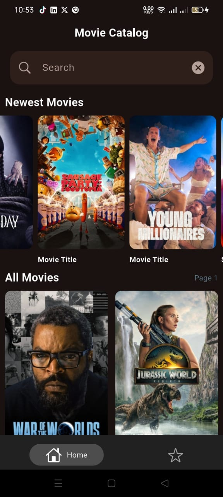
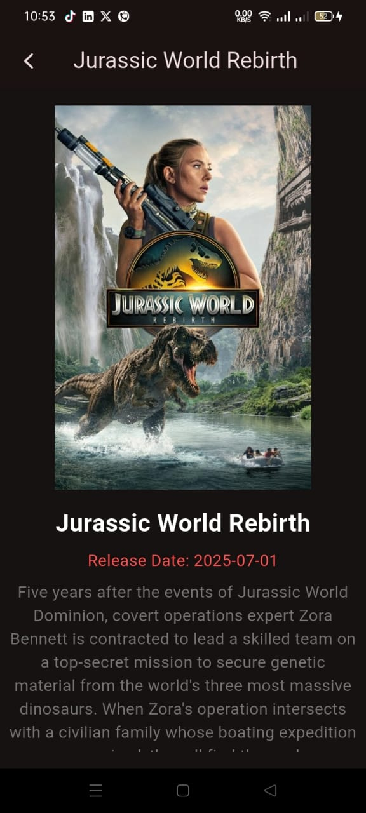
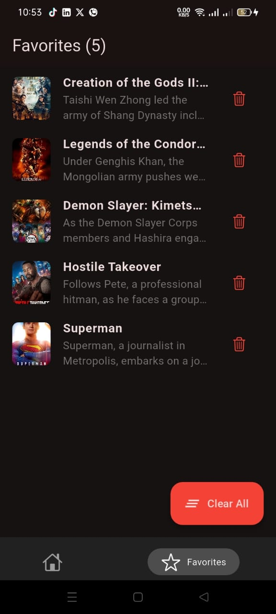

# 🎬 Aflam - Movie Discovery App

<p align="center">
  
</p>

<p align="center">
  <strong>A modern Flutter application for discovering and managing your favorite movies</strong>
</p>

<p align="center">
  <a href="https://flutter.dev">
    
  </a>
  <a href="https://dart.dev">
    
  </a>
  <a href="https://opensource.org/licenses/MIT">
    
  </a>
</p>

## 📱 Overview

Aflam is a sleek and intuitive movie discovery application built with Flutter. It leverages The Movie Database (TMDB) API to provide users with an extensive catalog of movies, trending content, and personalized favorites management. The app features a modern UI with smooth animations, efficient caching, and real-time data synchronization.

## ✨ Features

### 🏠 **Home Screen**
- **Trending Movies**: Discover daily trending movies in a horizontal scrollable list
- **Movie Grid**: Browse all movies in an organized grid layout with pagination
- **Search Functionality**: Real-time movie search with instant results
- **Custom ScrollView**: Optimized scrolling performance with slivers
- **Pagination Controls**: Navigate through multiple pages of movie content

### 🔍 **Movie Discovery**
- **Hero Animations**: Smooth transitions between screens with unique hero tags
- **Image Caching**: Optimized image loading with `CachedNetworkImage`
- **Error Handling**: Graceful fallbacks for failed image loads
- **Loading States**: Beautiful loading indicators and placeholders

### 📖 **Movie Details**
- **Comprehensive Information**: Title, overview, release date, rating, and adult content indicators
- **Visual Design**: Full-screen movie posters with hero animations
- **Rating Display**: Star-based rating system with precise scores
- **Add to Favorites**: One-tap favorite management with duplicate prevention

### ⭐ **Favorites Management**
- **Real-time Updates**: Instant UI updates using `ValueListenableBuilder`
- **Persistent Storage**: Local data persistence with Hive database
- **Swipe to Delete**: Intuitive gesture-based removal
- **Undo Functionality**: Restore accidentally deleted favorites
- **Bulk Actions**: Clear all favorites with confirmation dialog
- **Live Counter**: Dynamic favorites count in the app bar

### 🧭 **Navigation**
- **Bottom Navigation**: Persistent navigation bar with smooth transitions
- **State Management**: Efficient navigation state preservation
- **Gesture Support**: Android back button handling

## 🛠️ Technologies & Architecture

### **Frontend Framework**
- **Flutter 3.8.1+**: Google's UI toolkit for beautiful, natively compiled applications
- **Dart**: Modern programming language optimized for UI development

### **State Management**
- **Flutter BLoC 9.1.1**: Predictable state management using the BLoC pattern
- **Cubit**: Simplified state management for specific use cases

### **Navigation & Routing**
- **GoRouter 16.1.0**: Declarative route generation and navigation
- **Persistent Bottom Navigation Bar 6.2.1**: Advanced bottom navigation with state preservation

### **Data & Storage**
- **HTTP 1.5.0**: RESTful API communication
- **Hive 2.2.3**: Lightweight, fast NoSQL database for local storage
- **Hive Flutter 1.1.0**: Flutter-specific Hive integration
- **Hive Generator 2.0.1**: Code generation for type-safe data models

### **UI & User Experience**
- **Cached Network Image 3.4.1**: Efficient image caching and loading
- **Material Design 3**: Modern Google design system
- **Custom Animations**: Smooth hero animations and transitions
- **Responsive Design**: Adaptive layouts for different screen sizes

### **Development Tools**
- **Build Runner 2.5.4**: Code generation automation
- **Flutter Lints 5.0.0**: Comprehensive code quality rules
- **Meta 1.16.0**: Annotations for better code analysis

## 🏗️ Project Architecture

```
lib/
├── 📁 core/
│   ├── 📁 models/         # Data models with Hive annotations
│   │   ├── movie_model.dart
│   │   └── movie_model.g.dart
│   ├── 📁 router/         # Navigation configuration
│   │   └── app_router.dart
│   ├── 📁 secrets/        # API configuration
│   │   └── secrets.dart
│   ├── 📁 services/       # API service layer
│   │   └── api.dart
│   └── 📁 theme/          # App theming
│       └── app_theme.dart
├── 📁 features/
│   ├── 📁 bottom_nav/     # Navigation component
│   │   └── bottom_nav.dart
│   ├── 📁 home/           # Home screen feature
│   │   ├── 📁 view/
│   │   │   ├── 📁 screens/
│   │   │   └── 📁 widgets/
│   │   └── 📁 view_model/
│   │       └── 📁 cubit/
│   ├── 📁 details/        # Movie details feature
│   │   └── 📁 view/
│   │       └── 📁 screens/
│   └── 📁 marked/         # Favorites feature
│       └── 📁 view/
│           ├── 📁 screens/
│           └── 📁 widgets/
└── main.dart
```

## 🔧 API Integration

### **The Movie Database (TMDB) API**
- **Base URL**: `https://api.themoviedb.org/3`
- **Endpoints Used**:
  - `/trending/all/day` - Daily trending content
  - `/discover/movie` - Movie discovery with pagination
  - `/search/movie` - Movie search functionality
- **Image CDN**: `https://image.tmdb.org/t/p/w500/` for poster images

### **Features Implemented**:
- **Trending Movies**: Real-time trending content
- **Movie Discovery**: Paginated movie browsing
- **Search**: Real-time movie search
- **Detailed Information**: Comprehensive movie metadata

## 📦 Key Dependencies

```yaml
dependencies:
  flutter: sdk: flutter
  
  # State Management
  bloc: ^9.0.0
  flutter_bloc: ^9.1.1
  
  # Navigation
  go_router: ^16.1.0
  persistent_bottom_nav_bar: ^6.2.1
  
  # Data & Storage
  http: ^1.5.0
  hive: ^2.2.3
  hive_flutter: ^1.1.0
  
  # UI & Caching
  cached_network_image: ^3.4.1
  cupertino_icons: ^1.0.8
  meta: ^1.16.0

dev_dependencies:
  # Code Generation
  hive_generator: ^2.0.1
  build_runner: ^2.5.4
  
  # Linting
  flutter_lints: ^5.0.0
```

## 🚀 Getting Started

### **Prerequisites**
- Flutter SDK 3.8.1 or higher
- Dart SDK 3.0.0 or higher
- Android Studio / VS Code
- TMDB API Key

### **Installation**

1. **Clone the repository**
   ```bash
   git clone https://github.com/HossamAhmed954074/Aflam.git
   cd aflam
   ```

2. **Install dependencies**
   ```bash
   flutter pub get
   ```

3. **Generate Hive adapters**
   ```bash
   flutter packages pub run build_runner build
   ```

4. **Configure API Key**
   - Update `lib/core/secrets/secrets.dart` with your TMDB API key
   ```dart
   static const String apiKey = "YOUR_TMDB_API_KEY";
   ```

5. **Run the application**
   ```bash
   flutter run
   ```

## 📱 Screenshots

| Home Screen | Movie Details | Favorites |
|-------------|---------------|-----------|
|  |  |  |

## 🎯 Key Features Highlights

### **Performance Optimizations**
- **Image Caching**: Reduces network requests and improves loading times
- **Memory Management**: Optimized cache sizes and efficient widget rebuilding
- **Lazy Loading**: On-demand content loading with pagination
- **Hero Animations**: Shared element transitions for smooth UX

### **User Experience**
- **Real-time Updates**: Instant UI updates without manual refresh
- **Gesture Support**: Swipe-to-delete and intuitive navigation
- **Error Handling**: Graceful fallbacks and user feedback
- **Offline Support**: Local favorites storage works without internet

### **Code Quality**
- **Type Safety**: Strong typing with code generation
- **Clean Architecture**: Separation of concerns with feature-based structure
- **State Management**: Predictable state with BLoC pattern
- **Null Safety**: Full null safety compliance

## 🤝 Contributing

1. Fork the repository
2. Create a feature branch: `git checkout -b feature/amazing-feature`
3. Commit your changes: `git commit -m 'Add amazing feature'`
4. Push to the branch: `git push origin feature/amazing-feature`
5. Open a Pull Request

## 📄 License

This project is licensed under the MIT License - see the [LICENSE](LICENSE) file for details.

## 👨‍💻 Developer

**Hossam Ahmed**
- GitHub: [@HossamAhmed954074](https://github.com/HossamAhmed954074)
- Email: [your-email@example.com](mailto:your-email@example.com)

## 🙏 Acknowledgments

- [The Movie Database (TMDB)](https://www.themoviedb.org/) for providing the movie data API
- [Flutter Team](https://flutter.dev/) for the amazing framework
- [BLoC Library](https://bloclibrary.dev/) for excellent state management
- [Hive](https://hivedb.dev/) for fast local storage

---

<p align="center">
  <strong>Built with ❤️ using Flutter</strong>
</p>
